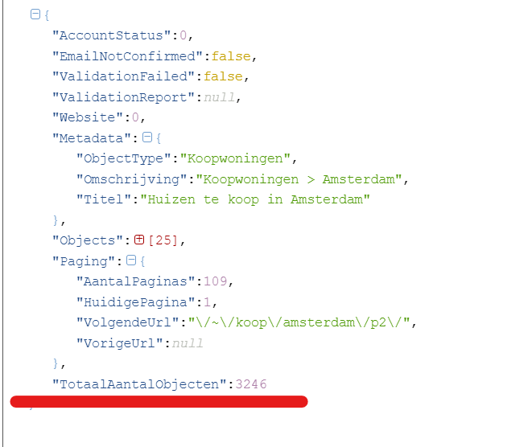
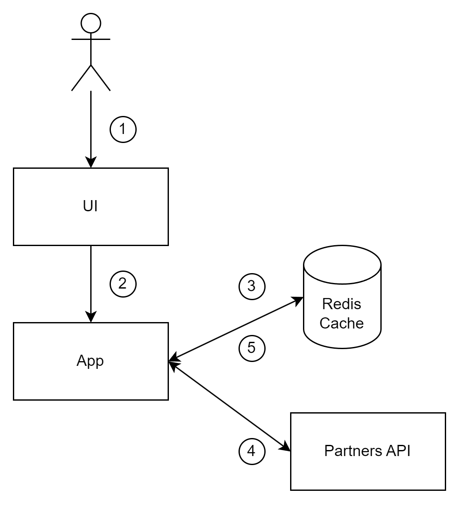
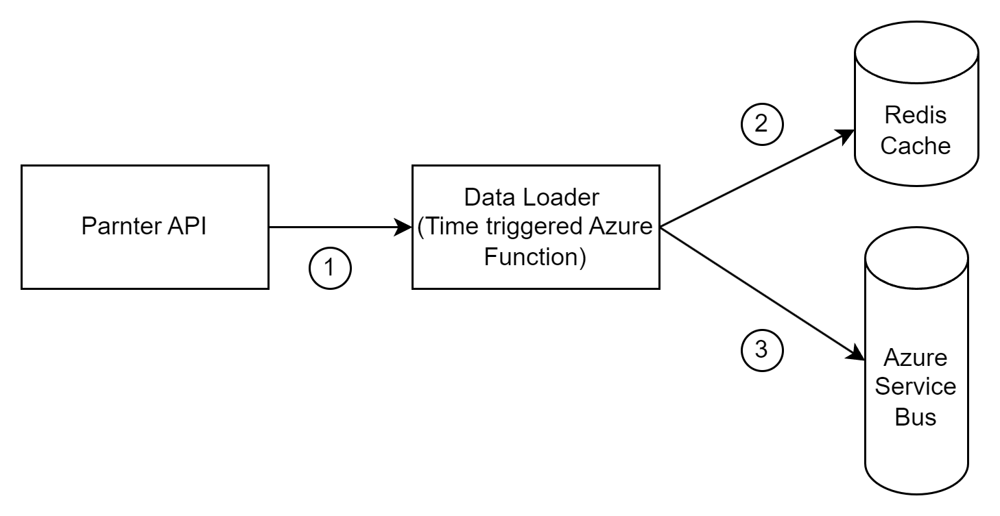
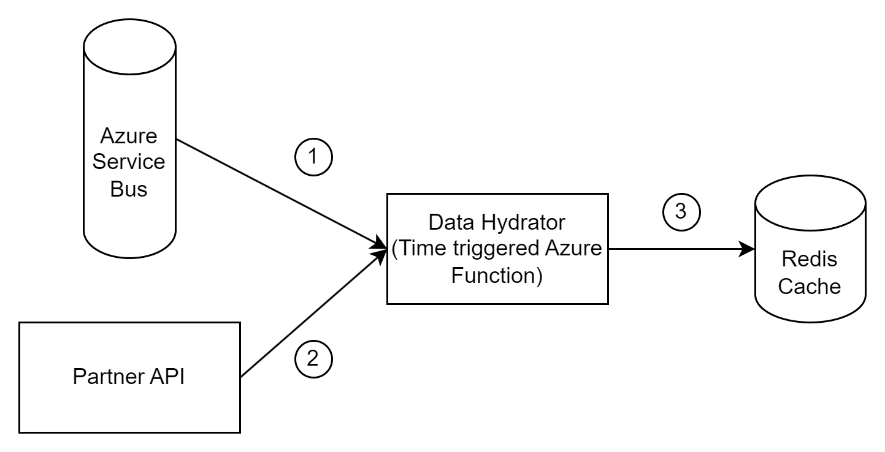
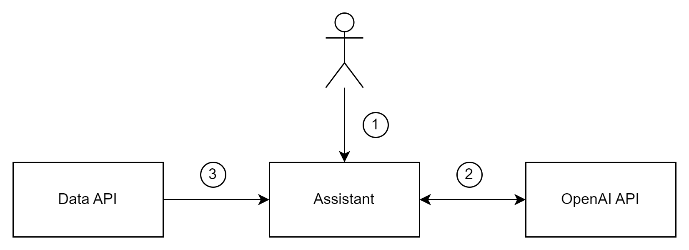

# Funda Analytics

## Problem Statement

To avoid disclosing the task on the public service, please refer to the provided PDF file with the problem description.

## Terminology

By property listing or just property, I mean a home suitable for purchasing.
By real estate broker, I mean makelaar.

## Requirements

Based on the problem statement, we can define the following functional and non-functional requirements.

**Key functional requirements:**

1. Users should be able to see which real estate broker in Amsterdam has the most properties listed for sale.
2. Users should be able to see the top 10 real estate brokers in Amsterdam that have the most properties listed for sale.
3. Users should be able to see which real estate brokers in Amsterdam have the most properties with a garden listed for sale.
4. Users should be able to see the top 10 real estate brokers in Amsterdam that have the most properties with a garden listed for sale.

**Key non-functional requirements:**

1. Multiple users should be able to use the system at the same time.
2. The data returned by the system should be up to date with the source and must not be older than 1 day.
3. The application should be responsive, and the result should be provided in less than 3 seconds.

## Design Decision

As a first step, let’s take a look at what data we have. To do this, I did some experiments with the provided endpoint and noticed the following:

1. In the API response, we can see that data storage contains 3246 properties:

    
<br>

2. After experimenting with the page size, I can say that the max page size is 25:

    

    
<br>

3. The data provided by the API is not matching with the production environment. On production, we have 3954 homes without filters, and API returns 3246 properties without filters. Also, I noticed that a lot of properties became available at night.

    
<br>


4. I tried to use the provided WSHTTP endpoint to get some data but was not able to access it:

    
<br>

5. GET request to [https://partnerapi.funda.nl/feeds/Aanbod.svc/json/{apiKey}/?type=koop&zo=/amsterdam/&page=1&pagesize=25](https://partnerapi.funda.nl/feeds/Aanbod.svc/json/%7BapiKey%7D/?type=koop&zo=/amsterdam/&page=1&pagesize=25) returns data, but that data does not contain any information about the property, so we cannot say does this property has a garden or not.

    
<br>

6. My next thought was: If Funda has an API endpoint for accessing the data, there should be documentation on how to use it, and I need to find that documentation in order to get the endpoint for getting particular property details. So, after searching on the internet, I came across some old API documentation:

    
    
    <br>
    In this documentation, it was mentioned that partnerapi.funda.nl is a production URL, so my next thought was that if we have an API endpoint, it should be used somewhere. So I searched on GitHub for “partnerapi funda Aanbod.svc json get details” with the hope of finding a method for getting property details. And I was lucky enough to find URL https://partnerapi.funda.nl/feeds/Aanbod.svc/json/detail/{apiKey}/koop/{propertyId}/ for getting home info:

    
    
    <br>
    I tried to call the URL I found, and it worked!

    

    This response contained all the needed info, even more: Tuin, BalkonDakterras, Garage, etc.

<br>

So, after my experiments with the API, I found out that I can use two endpoints:
1. [**https://partnerapi.funda.nl/feeds/Aanbod.svc/json/{apiKey}/?type=koop&zo=/amsterdam/&page=1&pagesize=25**](https://partnerapi.funda.nl/feeds/Aanbod.svc/json/%7BapiKey%7D/?type=koop&zo=/amsterdam/&page=1&pagesize=25) - For getting the list of all properties available on Funda.
2. [**https://partnerapi.funda.nl/feeds/Aanbod.svc/json/detail/{apiKey}/koop/{propertyId}/**](https://partnerapi.funda.nl/feeds/Aanbod.svc/json/detail/%7BapiKey%7D/koop/%7BpropertyId%7D/) - For getting information about a particular property listing.

Based on the available data and requirements we have, I think we have several options for how to implement the solution.

### Option 1

The first approach is based on the usage of the [**https://partnerapi.funda.nl/feeds/Aanbod.svc/json/{apiKey}/?type=koop&zo=/amsterdam/&page=1&pagesize=25**](https://partnerapi.funda.nl/feeds/Aanbod.svc/json/%7BapiKey%7D/?type=koop&zo=/amsterdam/&page=1&pagesize=25) URL, and doing all the calculation in the single application.

We can get all the property listings with the filter (Amsterdam, garden/no garden) by calling Partners API for all pages; then, we can do all needed calculations and return the result to the user by displaying it on a UI.

Since we have a lot of property listings added around midnight, and we can assume that properties are not added very frequently, we can cache the calculated result.

Rate limiting can be implemented by using two mechanisms: 1) As we would have Redis for storing cached results, we can use it for storing limits, and based on this, we can implement one of the rate-limiting algorithms like token bucket or sliding window. 2) We can also utilize some libraries (e.g., Polly) that will add the ability to retry HTTP calls based on some rules. So we can have some retry strategy to mitigate rate-limiting cases and failed calls.

<br>
Please find below a simple scheme of the architecture:



<br>

1. As a first step, a user opens a web page with UI.
2. UI calls the application API.
3. Then, the application tries to get the calculated data from a cache. If the value is found, the app returns it to the user.
4. If cached calculations are missing, the app calls Partners API to get the data.
5. After getting the data from the Partners API and calculating the result, we can save it in the cache and return it to the user.

Technologies I would use for this option: .NET, JavaScript, any UI framework like React or Vue, Azure Redis Cache, Azure App Service, and Azure Static Web Apps.
<br>

This approach has its pros and cons, which are described in the table below:

| Pros | Cons |
| --- | --- |
| Simple and straightforward architecture | The first call will take 2 minutes to get the data for a particular filter |
| It can be implemented quickly | It is harder to extend functionality (we do not have much info about the property in the API response we wanted to use) |
| Easier to test and debug | Limited functionality of the solution (we do not have much info about the property in the API response we wanted to use) |
|  | I probably won’t learn anything new during the development |
|  | The solution is not creative at all |

### Option 2

The second option is based on the usage of both URLs we have [**https://partnerapi.funda.nl/feeds/Aanbod.svc/json/{apiKey}/?type=koop&zo=/amsterdam/&page=1&pagesize=25**](https://partnerapi.funda.nl/feeds/Aanbod.svc/json/%7BapiKey%7D/?type=koop&zo=/amsterdam/&page=1&pagesize=25) and [**https://partnerapi.funda.nl/feeds/Aanbod.svc/json/detail/{apiKey}/koop/{propertyId}/**](https://partnerapi.funda.nl/feeds/Aanbod.svc/json/detail/%7BapiKey%7D/koop/%7BpropertyId%7D/).**

The idea is simple:

1. We can get the IDs of all property listings by using the first URL, and then we can save those values somewhere.
2. As a second step, we can call the second endpoint for each property listing to get all the information about it and also save this data somewhere.
3. Then, we can build an API around the data we have to serve it to the consumers.
4. And instead of just displaying the data on UI, we can try something different this time. We can use OpenAI’s assistant to provide analytics and insights based on our data.

<br>
Now, let’s dive into more details for each step.
<br>

**In the diagram below, you can find the process of loading property listing IDs.**

1. Since we have a lot of property listings added during the night, and we do not have a lot of property additions, I assume that we are okay with having data updated once per day, let’s say at 2:00 at night. For this, we can utilize Azure Function with the time trigger. So this Azure Function, let’s call it ‘Data Loader’, can call Partner API and get IDs of all properties we have.
2. As a next step, we need to save the data somewhere. For this purpose, I propose to store the data in the cache because: 1) There is no point in data duplication since Funda already stores it. 2) Storing in a cache is faster. 3) I would like to test the performance of the [JSON module in Redis.](https://redis.io/docs/data-types/json/)
3. After saving it in the cache, we need to have the data hydrated. For this, we will have a separate function. But to maintain this process for each property listing, I suggest adding a new message to an Azure Service Bus queue so that another function can consume messages and hydrate the data.



<br>

**In the diagram below, you can find the process of data hydration.**

1. After we get the data about all property listings, we need to get additional details using the second URL. To fill in all the data, we need to do more than 3K API calls, but because of the limitation of the API (100 calls per minute), we need to do this gradually. We cannot just consume the messages from Service Bus because we will hit the rate limit very quickly. Instead, we can manually receive some records per function execution. For example, we can schedule the function to run every 30 seconds and consume 50 records from the Service Bus.
2. Then, we can iterate over received messages and call Partner API to get the property details (for this assignment, let’s take only a limited amount of fields).
3. After getting the data, we can update the particular key of the JSON in the Redis cache.



<br>

**In the diagram below, you can find the process of accessing our data through OpenAI’s assistant.**

Before diving into this step, let’s take a look at OpenAI’s assistant.

OpenAI Assistant is an AI-powered tool developed by OpenAI. It's designed to assist with a variety of tasks by providing information, answering questions, and helping users solve problems. It's capable of understanding and generating human-like text based on the prompts given to it.

The most exciting feature is that this assistant is modular. This means we have the ability to integrate new modules, such as one that interacts with our API for data retrieval. For instance, let's imagine we asked a question about the weather. Prior to this, we added a new function called 'GetCurrentWeather,' which calls the weather provider API. When responding to the weather-related question, the assistant will invoke this API and craft its response using the data obtained.

More details can be found here: [https://platform.openai.com/docs/assistants/overview](https://platform.openai.com/docs/assistants/overview).

1. In the scope of this assignment, let’s not focus on the interface of interaction between the user and the OpenAI’s assistant. As for now, let’s use a Python script for input/output. So, as a first step, the user can specify the question in the script and run it.
2. The assistant will call the OpenAI API to form the response.
3. In case some extra data is needed, it will call out API and pass this data back to OpenAI, and only then will it craft the message based on the data obtained.



<br>

**Now, let’s discuss rate limiting.** 

I suggest the following for the **‘Data Loader’** function:

1) As a first layer, let’s add a rate limiter with a fixed window algorithm. We will increase the counter each time we call the API. And when the limit is reached, let’s wait for the next API calls.

2) The rate limiter won’t help with transient issues, and in the case when the API key is shared. So, let’s add a Polly library that will add the ability to retry HTTP calls based on some rules. So we can have some retry strategy to mitigate rate-limiting cases and failed calls.

3) And as final protection, let’s add the exponential backoff function retry in the case of unsuccessful API calls, but only when the first 2 layers of protection did not work.

For the **‘Data Hydrator’** function, I suggest the following:

1) As a first step, we can schedule the function to run every 30 seconds and consume 50 records from the Service Bus. With this configuration, we should not hit the limit.

2) But again, the rate limiter won’t help with transient issues, and in the case when the API key is shared. So, let’s add a Polly library that will add the ability to retry HTTP calls based on some rules. So we can have some retry strategy to mitigate rate-limiting cases and failed calls.

3) And as final protection, if we have some issues, we just won’t complete the message. In this case, the message will still be in the queue, ready to be consumed the next time.

<br>
Technologies I would use for this option: .NET, Python (for integrating with the OpenAI), Redis Cache, Azure Service Bus, and Azure Functions.
<br>

This approach also has some positive and negative moments, which are described in the table below:

| Pros | Cons |
| --- | --- |
| The solution can provide more functionality for the user | Higher complexity |
| Higher fault isolation | Service with several components is harder to support and maintain |
| A lot of new things to learn | Implementation is more time-consuming |
| Easy to extend functionality | Harder to test |
|  | Data hydrating can take a lot of time |
|  | A lot of calls to the Partner API |
|  | This is an overengineering |

### Design Decision Conclusion

Each option has its pros and cons. Option 1 will definitely solve our problem, and it is quicker to implement. But I’m curious about experimenting with Azure Functions and OpenAI assistant, so I would go with option 2.

## Solution Overview & Implementation Notes

In this part, I will try to describe created services on a high level. Please refer to the sources to get more details about the implementation.

So, the solution consists of the following projects:

1. Tests - Unit tests of some projects.
2. CacheClient - Wrapper around Redis cache string and JSON methods.
3. DataApi - Azure Function with API endpoints.
4. DataHydrator - Azure Function that gets additional data for each property listing.
5. DataLoader - Azure Function that retrieves and saves all property listing IDs.
6. PartnerAPIClient - Wrapper around Partner API.
7. PartnerAPiModels - Models and DTOs used in the project.


<br>

PartnerApiModels:


<br>

PartnerApiClient:


<br>

CacheClient:


<br>

DataLoader:


<br>

DataHydrator:


<br>

DataApi:


<br>

DataAssistant script outside of the solution:


<br>

The DataApi function contains six GET methods mentioned below. They all have such explicit names because I thought that it would be easier for OpenAI assistant to consume such endpoints (but this is questionable and should be tested):

- /api/GetAllRealEstateBrokers
- /api/GetRealEstateBrokerById/{id}
- /api/GetTopRealEstateBrokersWithTheMostAmountOfHomes
- /api/GetTopRealEstateBrokersWithTheMostAmountOfHomesWithBalconyOrTerrace
- /api/GetTopRealEstateBrokersWithTheMostAmountOfHomesWithGarage
- /api/GetTopRealEstateBrokersWithTheMostAmountOfHomesWithGarden

<br>

As a final step of the development, I covered some services with unit tests. 


## Testing Notes

Now, let’s try to test our solution.

<br>

As a first step, let’s run the ‘DataLoader’ function.

During the run, I confirmed that the rate limit variable is updating in Redis:


<br>

In the picture below, you can see that the function was running for 10 minutes:


<br>

If we check the message queue, we will see that the first message was added at 11:34, so adding all events took 8 minutes, and calling Partner API took 2 minutes, minus a 1-minute delay:


<br>

If we take a look at the queue itself, we will see that we have 3215 messages added:


<br>

Let’s take a look at the data in Redis. We can see a JSON file with a length of 3215 items and a key size of 234 KB:


<br>

Now, let’s run ‘DataHydrator’:


<br>

Let’s check the queue. As you can see in the picture, the amount of messages is decreasing:


<br>

And at the end, the queue is empty:


<br>

Execution of the ‘DataHydrator’ took an hour. This is because of the way messages are retrieved from the Service Bus Queue. You can only specify the maximum amount of records you want to receive. So you can specify 10, but you can get any amount up to 10, like 8 or 5.

The full dataset is 2MB:


Example of added data for a particular property listing:


<br>

Let’s check the API. To get all the info and make all the calculations, it takes 411 ms:


<br>

**Of course, the solution described above is not perfect, but it can be improved:**

1. It is possible to improve the DataApi function by caching the calculated results.
2. It is possible to improve DataLoader by not rewriting all records. We can remove records that do not exist in Partner API from the cache and add only those records that are presented in Partner API but not presented in the cache. This will give a significant boost to performance.
3. Interaction between a user and the assistant is not convenient. We can put calls to OpenAI in an API and use this API in some UI applications.
4. Probably it will be better to replace Service Bus with something else. It takes a lot of time to send all the messages, and we do not use message streaming, but we would like to have message batch receiving. Maybe using CosmosDB can help here.

## Results

Now, let’s take a look at the result.

### API

**We can call API /api/GetAllRealEstateBrokers to get all 452 brokers:**

```json
[
	{
		"FundaId":24705,
		"Name":"Eefje Voogd Makelaardij",
		"PhoneNumber":"020-3050560",
		"AmountOfHomesWithGarden":14,
		"AmountOfHomesWithBalconyOrTerrace":29,
		"AmountOfHomesWithGarage":15,
		"TotalAmountOfHomes":39
	},
	{
		"FundaId":24607,
		"Name":"KRK Makelaars Amsterdam",
		"PhoneNumber":"020-44 000 00",
		"AmountOfHomesWithGarden":8,
		"AmountOfHomesWithBalconyOrTerrace":14,
		"AmountOfHomesWithGarage":7,
		"TotalAmountOfHomes":20
	},
	{
		"FundaId":60821,
		"Name":"Makelaardij Prins van Wijngaarden",
		"PhoneNumber":"0202299415",
		"AmountOfHomesWithGarden":3,
		"AmountOfHomesWithBalconyOrTerrace":3,
		"AmountOfHomesWithGarage":1,
		"TotalAmountOfHomes":7
	},
...........
```

<br>

**We can API /api/GetRealEstateBrokerById/60821 to get all property listings for a particular real estate broker:**

```json
{
	"FundaId":60821,
	"Name":"Makelaardij Prins van Wijngaarden",
	"PhoneNumber":"0202299415",
	"AmountOfHomesWithGarden":3,
	"AmountOfHomesWithBalconyOrTerrace":3,
	"AmountOfHomesWithGarage":1,
	"TotalAmountOfHomes":7,
	"PropertyListings":[
		{
			"FundaId":"51ec9863-6aca-46c3-ae8f-0939c3b1abd2",
			"AddedDateTime":"2023-11-29T08:27:44",
			"Address":"Bartholomeus Diazstraat 37 H",
			"HasGarden":true,
			"HasBalconyOrTerrace":false,
			"HasGarage":false
		},
		{
			"FundaId":"166f5a88-e122-4dff-b722-ff0aa5701be0",
			"AddedDateTime":"2023-11-28T11:20:06",
			"Address":"Majanggracht 14",
			"HasGarden":true,
			"HasBalconyOrTerrace":false,
			"HasGarage":true
		},
		{
			"FundaId":"97b9e2f7-c017-451c-88e0-5ccacad30355",
			"AddedDateTime":"2023-10-30T12:57:35",
			"Address":"Brachthuijzerstraat 7 2\u002B3",
			"HasGarden":false,
			"HasBalconyOrTerrace":true,
			"HasGarage":false
		},
		{
			"FundaId":"79d16c2d-eb1b-46ec-aa8e-6d2402e6f259",
			"AddedDateTime":"2023-10-04T14:22:31",
			"Address":"Oudeschans 69 B",
			"HasGarden":false,
			"HasBalconyOrTerrace":false,
			"HasGarage":false
		},
		{
			"FundaId":"651321f1-b1af-4d68-ba8e-432caf95f377",
			"AddedDateTime":"2023-10-04T13:16:53",
			"Address":"Harry Koningsbergerstraat 150",
			"HasGarden":false,
			"HasBalconyOrTerrace":true,
			"HasGarage":false
		},
		{
			"FundaId":"6ee03ac2-7852-41f5-87fe-8357f798ea2e",
			"AddedDateTime":"2023-10-03T06:34:27",
			"Address":"Eerste Atjehstraat 113 1",
			"HasGarden":false,
			"HasBalconyOrTerrace":true,
			"HasGarage":false
		},
		{
			"FundaId":"440da00e-3f88-4e8f-bf39-364605110db3",
			"AddedDateTime":"2023-09-18T07:40:22",
			"Address":"Druivenstraat 42",
			"HasGarden":true,
			"HasBalconyOrTerrace":false,
			"HasGarage":false
		}
	]
}
```

<br>

**We can call API /api/GetTopRealEstateBrokersWithTheMostAmountOfHomes to get the top of real estate brokers with the biggest amount of properties:**

| Broker ID | Broker name | Homes with garden | Homes with balcony or terrace | Homes with garage | The total amount of homes |
| --- | --- | --- | --- | --- | --- |
| 24067 | Broersma Wonen | 52 | 55 | 19 | 90 |
| 24648 | Heeren Makelaars | 41 | 42 | 17 | 85 |
| 24592 | Ramón Mossel Makelaardij o.g. B.V. | 24 | 60 | 45 | 85 |
| 24848 | KIJCK. makelaars Amsterdam | 13 | 43 | 8 | 65 |
| 24065 | Carla van den Brink B.V. | 38 | 32 | 19 | 57 |
| 24605 | Hallie & Van Klooster Makelaardij | 4 | 27 | 5 | 57 |
| 24630 | Keizerskroon Makelaars | 12 | 31 | 2 | 51 |
| 24628 | Smit & Heinen Makelaars en Taxateurs o/z | 4 | 37 | 4 | 47 |
| 24131 | De Graaf & Groot Makelaars | 16 | 26 | 2 | 43 |
| 24122 | FRIS Woningmakelaars Amsterdam | 6 | 35 | 25 | 43 |

<br>

**We can call API /api/GetTopRealEstateBrokersWithTheMostAmountOfHomesWithGarden to get the top of real estate brokers with the biggest amount of properties with garden:**

| Broker ID | Broker name | Homes with garden | Homes with balcony or terrace | Homes with garage | The total amount of homes |
| --- | --- | --- | --- | --- | --- |
| 24067 | Broersma Wonen | 52 | 55 | 19 | 90 |
| 24648 | Heeren Makelaars | 41 | 42 | 17 | 85 |
| 24065 | Carla van den Brink B.V. | 38 | 32 | 19 | 57 |
| 24592 | Ramón Mossel Makelaardij o.g. B.V. | 24 | 60 | 45 | 85 |
| 24131 | De Graaf & Groot Makelaars | 16 | 26 | 2 | 43 |
| 24705 | Eefje Voogd Makelaardij | 14 | 29 | 15 | 39 |
| 24584 | JA! Jaap Admiraal makelaardij | 13 | 14 | 0 | 24 |
| 12285 | Makelaarsland | 13 | 18 | 0 | 36 |
| 24848 | KIJCK. makelaars Amsterdam | 13 | 43 | 8 | 65 |
| 24599 | DSTRCT Amsterdam | 13 | 20 | 9 | 39 |

<br>

**We can call API /api/GetTopRealEstateBrokersWithTheMostAmountOfHomesWithBalconyOrTerrace to get the top of real estate brokers with the biggest amount of properties with balconies or terraces:**

| Broker ID | Broker name | Homes with garden | Homes with balcony or terrace | Homes with garage | The total amount of homes |
| --- | --- | --- | --- | --- | --- |
| 24592 | Ramón Mossel Makelaardij o.g. B.V. | 24 | 60 | 45 | 85 |
| 24067 | Broersma Wonen | 52 | 55 | 19 | 90 |
| 24848 | KIJCK. makelaars Amsterdam | 13 | 43 | 8 | 65 |
| 24648 | Heeren Makelaars | 41 | 42 | 17 | 85 |
| 24628 | Smit & Heinen Makelaars en Taxateurs o/z | 4 | 37 | 4 | 47 |
| 24122 | FRIS Woningmakelaars Amsterdam | 6 | 35 | 25 | 43 |
| 24065 | Carla van den Brink B.V. | 38 | 32 | 19 | 57 |
| 24630 | Keizerskroon Makelaars | 12 | 31 | 2 | 51 |
| 24705 | Eefje Voogd Makelaardij | 14 | 29 | 15 | 39 |
| 24605 | Hallie & Van Klooster Makelaardij | 4 | 27 | 5 | 57 |

<br>

**We can call API /api/GetTopRealEstateBrokersWithTheMostAmountOfHomesWithGarage to get the top of real estate brokers with the biggest amount of properties with garage:**

| Broker ID | Broker name | Homes with garden | Homes with balcony or terrace | Homes with garage | The total amount of homes |
| --- | --- | --- | --- | --- | --- |
| 24592 | Ramón Mossel Makelaardij o.g. B.V. | 24 | 60 | 45 | 85 |
| 24122 | FRIS Woningmakelaars Amsterdam | 6 | 35 | 25 | 43 |
| 24065 | Carla van den Brink B.V. | 38 | 32 | 19 | 57 |
| 24067 | Broersma Wonen | 52 | 55 | 19 | 90 |
| 24648 | Heeren Makelaars | 41 | 42 | 17 | 85 |
| 24705 | Eefje Voogd Makelaardij | 14 | 29 | 15 | 39 |
| 24587 | Van de Steege Projectmakelaars | 7 | 5 | 15 | 22 |
| 24763 | RET Makelaars - De specialist van Amsterdam-Oost | 7 | 16 | 9 | 22 |
| 24599 | DSTRCT Amsterdam | 13 | 20 | 9 | 39 |
| 24848 | KIJCK. makelaars Amsterdam | 13 | 43 | 8 | 65 |

### Assistant

And now, the most interesting part.

<br>


So, I added an array of questions to the assistant script and ran it:


<br>

I got the following output (I put the text version below):


<br>

As you can see, in some cases, the assistant performs API calls to our DataApi to fetch some data.

<br>

**Please find the questions and answers of the assistant below:**

**User:** Give the phone number of the real estate broker with the most homes.

**Assistant:** The real estate broker with the most homes is Broersma Wonen. Their phone number is 020-3059777.

*In this question, the assistant made a call to the API, got the list of the brokers with the most properties, and selected the name and phone.*

<br>

<br>

**User:** Please give me the top 10 real estate brokers that own the most homes with gardens.

**Assistant:** Here are the top 10 real estate brokers that own the most homes with gardens:

1. **Broersma Wonen**
    - Phone Number: 020-3059777
    - Amount of Homes with Garden: 52
2. **Heeren Makelaars**
    - Phone Number: 020-4702255
    - Amount of Homes with Garden: 41
3. **Carla van den Brink B.V.**
    - Phone Number: 020-6717272
    - Amount of Homes with Garden: 38
4. **Ramón Mossel Makelaardij o.g. B.V.**
    - Phone Number: 020-3052662
    - Amount of Homes with Garden: 24
5. **De Graaf & Groot Makelaars**
    - Phone Number: 020-6627140
    - Amount of Homes with Garden: 16
6. **Eefje Voogd Makelaardij**
    - Phone Number: 020-3050560
    - Amount of Homes with Garden: 14
7. **JA! Jaap Admiraal makelaardij**
    - Phone Number: 020-3790900
    - Amount of Homes with Garden: 13
8. **Makelaarsland**
    - Phone Number: 088-2002000
    - Amount of Homes with Garden: 13
9. **KIJCK. makelaars Amsterdam**
    - Phone Number: 0202151337
    - Amount of Homes with Garden: 13
10. **DSTRCT Amsterdam**
    - Phone Number: 020-3309454
    - Amount of Homes with Garden: 13

*In this question, the assistant made a call to list brokers with gardens and selected the number of homes with gardens only.*

<br>

<br>

**User:** Give me property listings of the broker with the most amount of balconies.

**Assistant:** The real estate broker with the most amount of homes with a balcony or terrace is Ramón Mossel Makelaardij o.g. B.V. Currently, they have a total of 60 homes listed that feature either a balcony or terrace. Here are some of their property listings:

1. **Den Texstraat 1 -B**
    - Added on: 2023-11-29
    - Has Balcony/Terrace: Yes
    - Has Garden: No
    - Has Garage: No
2. **Zoomstraat 51 I**
    - Added on: 2023-11-25
    - Has Balcony/Terrace: Yes
    - Has Garden: No
    - Has Garage: No
3. **Haparandaweg 796**
    - Added on: 2023-11-24
    - Has Balcony/Terrace: Yes
    - Has Garden: No
    - Has Garage: No
4. **Wagenaarstraat 318**
    - Added on: 2023-11-23
    - Has Balcony/Terrace: Yes
    - Has Garden: No
    - Has Garage: No
5. **Orteliuskade 14 II**
    - Added on: 2023-11-23
    - Has Balcony/Terrace: Yes
    - Has Garden: No
    - Has Garage: No

Please note that this is not an exhaustive list of all their listings, but a sample to give you an idea of the properties they have on offer. If you would like more details or to see more listings, please let me know!

*During answering this question, the assistant made 2 API calls. The first one is to get the list of brokers with the most homes with balconies. Then, a second call is needed to get the property listings of a particular broker.*

<br>

<br>

**User:** Give me property listing adresses of the broker with the most amount of garages.

**Assistant:** The real estate broker with the most amount of homes with garages is Ramón Mossel Makelaardij o.g. B.V. Here's a selection of their property listings:

1. Haparandadam 2 A-9
2. Haparandadam 2 A9+PP
3. Coöperatiehof 12 Hs
4. Willem van Weldammelaan 81
5. Memeleiland 152 + PP
6. Up North Park Pj (Bouwnr. P3-26)
7. Up North Park Pl (Bouwnr. P2-18)
8. Up North Laan Lh (Bouwnr. L9-46)
9. Up North Laan La (Bouwnr. L6-29)
10. Up North Laan Ld (Bouwnr. L5-25)

Please note that this is not the complete list of their properties with garages. If you require further details on additional properties or specific information about the listings, feel free to let me know!

*During answering this question, the assistant also made 2 API calls. The first one is to get the list of brokers with the most homes with garages. Then, a second call is needed to get the property listings of a particular broker.*

<br>

<br>

**User:** When did a broker with the most houses add his last home?

**Assistant:** The broker with the most houses, Broersma Wonen, added their last home on November 28, 2023.

*During answering this question, the assistant also made 2 API calls. The first one is to get the list of brokers with the most homes. Then, a second call is needed to get the property listings of a particular broker. Then, the assistant selected the most recent date.*

## Conclusions

So, during this assignment, I did some interesting work with Funda’s Partner API. I was able to build functionality around the existing Partner API and use obtained data in OpenAI’s assistant.

I think this work can be a proof of concept of using OpenAI’s tools for analyzing data provided by some API.

During the assignment, I made the following conclusions:

1. I really liked interacting with the assistant; the tools provided by OpenAI look very promising. 
2. The Redis JSON module is very helpful and easy to use. Also, it shows pretty good performance.
3. Adding three thousand messages to the Service Bus Queue is not fast and takes several minutes.
4. It is not possible to get the exact number of messages from the Service Bus Queue. You can only specify the maximum amount of records you want to receive. So you can specify 10, but you can get any amount up to 10, like 8 or 5.
5. OpenAI’s API is still pretty expensive if we are talking about processing large amounts of data, especially the GPT 4 model.